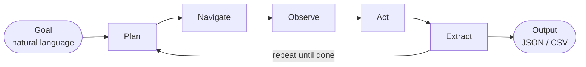

<p align="center">
<pre align="center">
  █████╗  ██████╗██████╗  █████╗ ██╗    ██╗██╗     
 ██╔══██╗██╔════╝██╔══██╗██╔══██╗██║    ██║██║     
 ███████║██║     ██████╔╝███████║██║ █╗ ██║██║     
 ██╔══██║██║     ██╔══██╗██╔══██║██║███╗██║██║     
 ██║  ██║╚██████╗██║  ██║██║  ██║╚███╔███╔╝███████╗
 ╚═╝  ╚═╝ ╚═════╝╚═╝  ╚═╝╚═╝  ╚═╝ ╚══╝╚══╝ ╚══════╝
</pre>
</p>

<p align="center">
  <strong>LLM-powered web crawler.</strong> Describe what you want in plain English — get structured data back.
</p>

<p align="center">
  <a href="https://github.com/Mingye-Lu/AgenticCrawler/actions/workflows/ci.yml"></a>
  <a href="LICENSE"></a>
  <a href="https://www.rust-lang.org/"></a>
</p>

<p align="center">
  Single binary. No Python runtime. 42 tools. 25 LLM providers. MCP server built-in.
</p>

---

## Why acrawl?

Most web scraping still means writing code: XPath selectors, pagination logic, retry handling, anti-bot workarounds. LLMs can read pages like humans do, but wiring one up to a browser is a project in itself.

acrawl is that wiring, packaged as a single Rust binary. You describe a goal; the agent figures out which pages to visit, what to click, what to extract, and when it's done.

- **No code required.** Describe the goal in English. The agent plans and executes.
- **One binary, zero runtimes.** `cargo build --release` produces a self-contained executable. No Python, no Node runtime — just Rust and a Chromium download for browser automation.
- **Smart fetching.** Static pages are served over HTTP (fast). When JavaScript or interaction is needed, acrawl detects JS framework markers (`__next_data__`, `__nuxt`, `__vue`, `ng-app`, React roots), auth redirects, and short `<noscript>` bodies — then transparently escalates to a headless browser.
- **42 tools, not a chatbot.** The agent has real tools — navigate, click, fill forms, run JS, take screenshots, switch device emulation, manage tabs, run deterministic scripts — plus a fork/join layer to spawn parallel sub-agents across multiple browser tabs. Includes 12 DevTools and observation tools for network inspection, performance monitoring, and accessibility auditing.
- **25 LLM providers.** Anthropic, OpenAI, Google Gemini, DeepSeek, AWS Bedrock, Azure OpenAI, Vertex AI, GitHub Copilot, Groq, Mistral, xAI, Cohere, Alibaba DashScope, OpenRouter, and more. Or bring your own via any OpenAI-compatible endpoint.
- **MCP client.** Extend the agent with custom tools via [Model Context Protocol](https://modelcontextprotocol.io) servers (stdio, SSE, HTTP, WebSocket).
- **MCP server.** `acrawl mcp` exposes 38 browser and script tools plus an autonomous `run_goal` agent to any MCP-compatible client — Claude Code, Cursor, Windsurf, VS Code, Zed, JetBrains, TRAE, Gemini CLI, and more. Install with `acrawl mcp install`.

### How does it compare?

#### vs. AI web agents and scraping tools

| | acrawl | browser-use | Stagehand | Skyvern | Firecrawl | Playwright MCP | Scrapy | Playwright scripts |
|---|:---:|:---:|:---:|:---:|:---:|:---:|:---:|:---:|
| No code needed | Yes | No | No | Partial | No | No | No | No |
| Single binary | Yes | No | No | No | No | No | No | No |
| JS rendering | Yes | Yes | Yes | Yes | Yes | Yes | No | Yes |
| LLM-powered navigation | Yes | Yes | Yes | Yes | Limited | No | No | No |
| No Python / Node needed | Yes | No | No | No | No | No | No | No |
| Form filling / interaction | Yes | Yes | Yes | Yes | No | Yes | No | Yes |
| Sub-agent parallelism | Yes | No | No | Partial | Partial | No | Partial | No |
| 25 LLM providers | Yes | Via LiteLLM | Partial | Partial | N/A | N/A | N/A | N/A |
| MCP client (use tools) | Yes | No | No | No | No | No | No | No |
| MCP server (expose as tools) | Yes | No | No | No | Yes | Yes | No | No |
| Stealth browser built-in | Yes | Cloud only | Via Browserbase | Cloud only | No | No | No | No |
| Open source | Yes | Yes (MIT) | Yes (MIT) | Yes (Apache) | Engine only | Yes (MIT) | Yes (BSD) | Yes (Apache) |

Notes:
- **browser-use** (85k+ GitHub stars): Python + Playwright, DOM + screenshots, supports GPT/Claude/Gemini/Ollama via LiteLLM, 89.1% WebVoyager. No single binary — requires Python and `pip install`. Every action calls an LLM: 2-5s/step, ~$0.02-0.30/task. Cloud tier adds stealth; self-hosted is bare Playwright.
- **Stagehand** (Browserbase, 21k+ stars): TypeScript + CDP (v3), mixes deterministic Playwright with AI primitives (`act()`, `extract()`, `observe()`). Action caching reuses successful clicks without re-calling the LLM. Requires Node and, for production, Browserbase cloud hosting.
- **Skyvern** (21k+ stars, Apache 2.0): vision-first (screenshot-only, no DOM), handles legacy portals and government forms that DOM tools struggle with. No-code cloud UI available. Each step costs vision-model tokens — ~$0.10-0.50/task. 85.85% WebVoyager.
- **Firecrawl** (82k+ stars): managed scraping API. Returns LLM-ready Markdown, JSON extraction, site-wide crawl. Not an agentic tool — minimal multi-step interaction. Ships an official MCP server. Per-page pricing from $19/month.
- **Playwright MCP** (Microsoft, 29k+ stars): MCP server that exposes browser control via the accessibility tree. Sub-100ms actions, zero vision tokens. Drives an LLM client's browser rather than having its own reasoning — no autonomous goal navigation. Used in GitHub Copilot Agent.

#### vs. native LLM provider browsing

Most AI providers offer some form of browsing, but it is designed for **conversational information retrieval**, not programmatic web automation. Key constraints:

| | acrawl | ChatGPT Agent | Claude Computer Use | Claude in Chrome | Gemini Deep Research | Copilot / Edge |
|---|:---:|:---:|:---:|:---:|:---:|:---:|
| Real JS-rendered browser | Yes | Yes (sandboxed cloud VM) | Indirect (dev provides env) | Yes (your Chrome) | No (search API only) | Limited (Bing retrieval) |
| Click / fill forms | Yes | Yes (requires user confirmation) | Yes | Yes | No | Limited |
| Programmable / scriptable | Yes | No | Yes (API beta) | No | No | No |
| Sub-agent parallelism | Yes | No | No | No | No | No |
| MCP server (expose as tools) | Yes | No | No | No | No | No |
| Returns structured data | Yes | No (text summaries) | No (screenshots) | No | No | No |
| Stealth / anti-bot | Yes | No | No | No | No | No |
| No vendor lock-in | Yes (25 providers) | OpenAI only | Anthropic only | Anthropic only | Google only | OpenAI / Bing only |
| Runs without paid subscription | Yes (OSS; LLM key needed) | No (Plus/Pro/Business) | No (API cost) | No (Max plan) | Partial | Yes (free tier) |

Notes:
- **ChatGPT Agent** (OpenAI, July 2025): runs in a sandboxed cloud virtual machine with its own Chromium instance. Can browse, click, and fill forms but pauses for user confirmation on sensitive actions (purchases, logins). Uses two modes: a fast text browser for research queries and a visual browser for interaction. Cannot run code in the browser, install extensions, or access your local file system. Susceptible to prompt injection. Available to Plus/Pro/Business subscribers.
- **ChatGPT Atlas** (OpenAI, October 2025): a full Chromium browser with ChatGPT integrated as a sidebar + agent. Agent mode drives the same sandboxed cloud VM as ChatGPT Agent; core limitations are identical.
- **Claude Computer Use** (Anthropic API, beta since October 2024): screenshot + mouse/keyboard API for any desktop application, not just browsers. Vision-only — no DOM access. Developers must provide and manage the entire computing environment (typically a Docker container with Xvfb + Firefox). Not a ready-to-use binary. Requires significant infrastructure to operate in production.
- **Claude in Chrome** (Anthropic Chrome extension, beta November 2025+): lets Claude operate within your existing Chrome session using your real cookies and logins. Available to Max plan subscribers. Not an open API — no programmatic control. Good for interactive personal tasks; not suitable for batch automation.
- **Gemini / Deep Research** (Google): browsing is grounded via Google Search API calls, not a live browser session. Deep Research synthesizes across many searches but cannot interact with pages (click, fill forms, navigate dynamically). Project Mariner (experimental computer use) is a separate, limited research preview.
- **Copilot / Edge** (Microsoft): Edge's Copilot Mode uses Bing retrieval with some ability to navigate pages. Real-world tests show high latency (6+ minutes for multi-page comparison tasks) and frequent interruptions for user confirmation. Not a developer API.

## Quick Start

### Install

**Linux / macOS (x64 / ARM64):**
```bash
curl -fsSL https://raw.githubusercontent.com/Mingye-Lu/AgenticCrawler/main/install.sh | bash
```

**Windows (x64, PowerShell):**
```powershell
irm https://raw.githubusercontent.com/Mingye-Lu/AgenticCrawler/main/install.ps1 | iex
```

This downloads the latest binary, verifies its SHA256 checksum, and sets up CloakBrowser for stealth browser automation. Requires Node.js 20+ for browser features.

acrawl checks for updates on startup and shows a notification when a new version is available.

<details>
<summary>Build from source</summary>

```bash
git clone https://github.com/Mingye-Lu/AgenticCrawler.git
cd AgenticCrawler
cargo build --release

# Install CloakBrowser (required for browser automation — binary auto-downloads on first use)
npm install
```

</details>

### Browser Extension (optional)

The acrawl Bridge extension lets acrawl control your real browser (with your sessions, cookies, and existing extensions) instead of a headless CloakBrowser instance. Download `acrawl-extension.zip` from the [latest release](https://github.com/Mingye-Lu/AgenticCrawler/releases/latest), unzip it, then load it into your browser:

| Browser | Extensions page | Developer mode toggle |
|---------|----------------|----------------------|
| Chrome | `chrome://extensions` | Top-right |
| Edge | `edge://extensions` | Bottom-left |
| Brave | `brave://extensions` | Top-right |
| Arc / Vivaldi / Opera | `<browser>://extensions` | Varies |

Enable **Developer mode**, click **Load unpacked**, and select the unzipped folder. Then run `/extension` in the acrawl REPL to connect. See [extension/README.md](extension/README.md) for full setup details.

### Configure

```bash
# Set up your LLM provider (interactive prompt)
./target/release/acrawl auth anthropic   # or: openai, other
```

Credentials are stored in `~/.acrawl/credentials.json`. Override the config directory with `ACRAWL_CONFIG_HOME`.

### Run

```bash
# Interactive REPL
./target/release/acrawl

# One-shot mode
./target/release/acrawl prompt "scrape all book titles and prices from books.toscrape.com"

# Resume a saved session
./target/release/acrawl --resume session.json /status /compact
```

## Examples

**Scrape a product catalog:**

```
acrawl > scrape all book titles, prices, and ratings from books.toscrape.com
```

The agent navigates to the site, reads the page, extracts the data, paginates through all 50 pages, and returns structured JSON.

**Fill and submit a form:**

```
acrawl > go to example.com/contact, fill in name "Jane Doe", email "jane@example.com",
         message "Hello", and submit the form
```

The agent locates form fields, fills them in, clicks submit, and confirms the result.

**Monitor a price:**

```
acrawl > check the current price of "Rust in Action" on books.toscrape.com
```

Single-page extraction — the agent fetches, reads, and returns the price without unnecessary navigation.

**Extract from JS-rendered pages:**

```
acrawl > get all repository names and star counts from github.com/trending
```

Static HTTP won't work here. acrawl detects React/Next.js markers and automatically escalates to a headless browser to render the JavaScript.

**Parallel multi-page crawl:**

```
acrawl > scrape the title, author, and price of every book across all 50 pages on books.toscrape.com.
         Fork a sub-agent for each page to speed this up.
```

The agent spawns up to 5 concurrent sub-agents, each on its own browser tab, to crawl pages in parallel. Results are merged when all sub-agents finish.

## Features

### 42-Tool Toolbox

#### Navigation

| Tool | Description |
|------|-------------|
| `navigate` | Go to a URL (supports `format`: markdown/text/html/fit_markdown). Uses HTTP first, auto-escalates to browser when JS is detected. Returns structured content with a `page_map`. `fit_markdown` prunes boilerplate DOM nodes before conversion, saving tokens. |
| `go_back` | Browser back button. Returns `page_state` with the resulting page structure. |
| `scroll` | Scroll up or down by pixel amount (`pixels`, default: 500). Returns `page_state` after scrolling. |
| `switch_tab` | Switch to a different browser tab by index. Returns `page_state` of the new tab. |
| `wait` | Wait for a CSS selector to reach a given state (`visible`, `hidden`, `attached`, `detached`) or a fixed timeout (up to 300s). Returns `page_state` after the condition is met. |
| `refresh` | Reload the current page. Returns `page_state` after reload. Use after setting intercept rules to replay the page load with rules active. Seq counter increments for temporal observation queries. |

#### Content Formats

The `navigate` tool's `format` parameter controls how the page is returned:

| Format | Description |
|--------|-------------|
| `markdown` | Full HTML → markdown conversion. All content preserved. |
| `fit_markdown` | **Recommended.** Prunes boilerplate before conversion, saving 30-60% tokens on typical pages. |
| `text` | Plain text, no markdown. |
| `html` | Raw HTML. |

`fit_markdown` works in two passes:

1. **Hard-block removal**, elements whose `class` or `id` attribute contains any of these strings are removed immediately: `nav`, `footer`, `header`, `sidebar`, `ads`, `comment`, `promo`, `advert`, `social`, `share`.
2. **Score-based pruning**, remaining elements are scored; anything below 0.48 is removed. The score is:

   ```
   0.4 × text_density
   + 0.2 × (1 − link_density)
   + 0.2 × tag_weight
   + 0.1 × class_id_score
   + 0.1 × ln(text_length + 1)
   ```

   Tag weights: `article` = 1.5 · `h1` = 1.2 · `h2` = 1.1 · `h3/p/section` = 1.0 · `h4` = 0.9 · `h5/table` = 0.8 · `h6` = 0.7 · `span` = 0.3 · `div/li/ul/ol` = 0.5.

**Use `markdown` instead of `fit_markdown` when:** the page has important content inside elements named `sidebar`, `nav`, or similar, for example, metadata panels, related-article links, or author info stored in a sidebar div.

If `fit_markdown` prunes all content (empty result), the tool automatically falls back to plain text.

#### Interaction

| Tool | Description |
|------|-------------|
| `click` | Click an element by CSS selector. Returns `page_state` after the click. |
| `click_at` | Click at specific viewport coordinates (x, y). Use for canvas, maps, or SVGs. Returns `page_state`. |
| `fill_form` | Fill form fields by selector or name, with optional auto-submit. Returns `page_state`. |
| `select_option` | Select a dropdown option by value, label, or index. Returns `page_state`. |
| `hover` | Hover over an element to reveal tooltips or menus. Returns `page_state`. |
| `press_key` | Press a keyboard key (Enter, Escape, Tab, etc.), optionally targeting an element. Returns `page_state`. |
| `set_device` | Switch browser device emulation (mobile/desktop). Supports 10 presets (iphone_15, pixel_7, ipad_pro, desktop, etc.) or custom viewport/UA/touch parameters. Returns differential `page_state` showing responsive layout changes. |
| `execute_js` | Run arbitrary JavaScript in the page context and return the result. |

#### Content Extraction

| Tool | Description |
|------|-------------|
| `page_map` | Get the page's structural map: headings, landmarks, forms, links, and interactive elements (with selectors and state). Supports `scope` to query within a specific element (e.g. a modal). |
| `read_content` | Extract text by heading name or CSS selector, with offset/limit pagination for large pages. |
| `list_resources` | List all links, images, and forms on the current page. |
| `screenshot` | Capture a full-page screenshot (base64 PNG). |
| `save_file` | Download a URL to the output directory (path traversal protected). |

#### DevTools & Observation

| Tool | Description |
|------|-------------|
| `list_network_activity` | List observed network requests buffered during this browser session. Supports temporal filtering by seq window, request-state filters, URL substring filtering, and adjective-based sorting such as slowest/fastest or newest/oldest. Returns stable @rN refs for follow-up inspection with inspect_request. |
| `inspect_request` | Inspect a previously listed network request by its @rN id from list_network_activity. Returns the captured request metadata, coarse timing summary, initiator type, and notes about unavailable headers/bodies. |
| `list_page_logs` | List buffered console logs for the current page with optional level filtering and seq-based temporal filtering. Group by exact message text (default, deduplicated with @logN IDs), source, or level. |
| `inspect_log` | Inspect a deduplicated console log group from list_page_logs and return concrete instances with timestamps, stack traces, and source locations. |
| `list_websocket_activity` | Overview of WebSocket connections and message counts. Returns connections with @wsN IDs. Use inspect_websocket to see actual message content. |
| `inspect_websocket` | Inspect actual WebSocket messages for a connection. Provide @wsN ID from list_websocket_activity. Supports direction filter, pattern search, and sort_by (newest/oldest). |
| `get_page_performance` | Get page performance metrics using Navigation Timing and Resource Timing APIs. Returns TTFB, DOM timings, and a breakdown of the top 20 resources by transfer size. Works on both browsers and SPAs. |
| `inspect_cookies` | Inspect cookies on the current page with security analysis. Returns all cookies with domain, path, expiry, secure/httponly flags, and detected security issues. Includes third-party detection and filtering options. |
| `inspect_storage` | Inspect browser storage (localStorage and sessionStorage) on the current page. Returns all key-value pairs with size information. Supports filtering by storage type and key pattern. |
| `measure_coverage` | Measure JavaScript and CSS code coverage on the current page. Returns per-file byte usage showing how much code was actually executed/applied versus total loaded. Useful for identifying unused bundles, oversized dependencies, and performance optimization opportunities. |
| `audit_accessibility` | Run axe-core WCAG accessibility audit on the current page. Returns violations grouped by impact level with selectors and descriptions. Use scope to limit to a specific DOM subtree. |
| `intercept_network` | Manage network interception rules. Block or mock requests matching URL glob patterns. Rules are additive — each call adds a rule. Use refresh() after adding rules to replay the page load with rules active. |

#### Agent Control

| Tool | Description |
|------|-------------|
| `fork` | Spawn a sub-agent on a new browser tab with its own goal and step budget. |
| `wait_for_subagents` | Wait for specific or all sub-agents to finish and collect results. |
| `subagent_status` | Check the status and results of one or all active sub-agents without blocking. |
| `cancel_subagent` | Cancel a running sub-agent by ID. |

#### Script Management

| Tool | Description |
|------|-------------|
| `run_script` | Execute a deterministic multi-step script (loops, conditionals, parallel branches) without per-step LLM calls. Returns a script_id for async tracking. |
| `save_script` | Persist a script definition to disk for reuse across sessions. |
| `list_scripts` | List all previously saved scripts with metadata. |
| `read_script` | Read the full JSON definition of a saved script. |
| `wait_for_scripts` | Block until one or more running scripts complete and return results. |
| `script_status` | Check execution status of a running script without blocking. |
| `cancel_script` | Abort a running script immediately. |

#### page_state Reference

Interaction tools (`click`, `click_at`, `fill_form`, `hover`, `press_key`, `go_back`, `scroll`, `switch_tab`, `select_option`, `set_device`, `refresh`) all return a `page_state` object. There are two variants:

**Full page_state**, returned after the first interaction on a URL, or when changes are too extensive to diff:

```json
{
  "url": "https://example.com/page",
  "title": "Page Title",
  "page_map": {
    "headings": [{ "level": 1, "text": "...", "id": "...", "selector": "...", "char_count": 0, "preview": "..." }],
    "landmarks": [{ "tag": "nav", "role": "navigation", "id": "...", "selector": "...", "text_preview": "..." }],
    "links": [{ "text": "...", "href": "...", "selector": "..." }],
    "interactive": { "counts": { "buttons": 0, "inputs": 0, "selects": 0, "textareas": 0, "total": 0 }, "elements": [] },
    "meta": { "title": "...", "url": "...", "description": "..." },
    "truncated_links": false,
    "truncated_forms": false,
    "truncated_landmarks": false
  }
}
```

**Diff page_state**, returned on subsequent interactions on the same URL, showing only what changed:

```json
{
  "url": "https://example.com/page",
  "title": "Page Title",
  "changed": true,
  "changes": {
    "added_headings": [],
    "removed_headings": [],
    "added_links": [],
    "removed_links": [],
    "added_landmarks": [],
    "removed_landmarks": [],
    "added_interactive": [{ "selector": "...", "tag": "...", "text": "..." }],
    "removed_interactive": [],
    "modified_interactive": [{ "selector": "...", "tag": "...", "text": "...", "state_changes": { "aria_expanded": "true" } }]
  }
}
```

If nothing changed, `{ "url": "...", "title": "...", "changed": false }` is returned. On bridge failure, `{ "url": "unknown", "title": "unknown", "page_map": null }`. Caps: max 50 links, 20 landmarks per page_state.


### Sub-Agent Parallelism

The agent can fork child agents to crawl multiple pages concurrently. Each child gets its own browser tab, step budget, and independent state.

| Setting | Default | Description |
|---------|---------|-------------|
| `max_concurrent_per_parent` | 5 | Max children running in parallel per parent |
| `max_fork_depth` | 3 | Max nesting depth (agents forking agents) |
| `max_total_agents` | 10 | Global cap across all parents |
| `fork_child_max_steps` | 15 | Step budget per child agent |
| `fork_wait_timeout_secs` | 60 | Timeout waiting for sub-agents |

#### URL Claiming

Before a child agent is spawned, its scope is registered in a shared claim registry. This prevents two sibling agents from crawling the same URL simultaneously.

**Rules:**
- **First-claimer-wins**, if a second agent tries to claim a URL already claimed by a sibling, the fork fails immediately with a conflict message naming the owner agent. The parent LLM sees this conflict and can adjust scope.
- **Three scope types:** `SinglePage` (exact URL), `UrlList` (all-or-nothing batch), `UrlPattern` (regex, checked for overlap with all existing claims).
- **RAII lifetime**, a claim is held for the life of the child. When the child finishes, is cancelled, or its parent aborts setup, the claim is released automatically and the URL becomes available again.
- **Cross-type checking**, an exact URL conflicts with any already-claimed regex that matches it, and a new regex conflicts with any already-claimed exact URL it would match.
- **Intra-list deduplication**, if the same URL appears twice in a `UrlList`, it is silently deduplicated (the LLM sometimes produces duplicates).

Claiming is **automatic**, it happens inside `fork` before the child starts, not inside `navigate`. The agent does not call it explicitly.

### Smart Fetch Routing

Every `navigate` call goes through a two-tier fetch router:

1. **HTTP first** — fast reqwest-based fetch (30s timeout, follows up to 10 redirects).
2. **Auto-escalation** — if any of the following are detected, the request is transparently replayed in a headless browser:
   - HTTP 403, 429, or 503 responses
   - JS framework markers: `__next_data__`, `__nuxt`, `__vue`, `ng-app`, `_react`, `data-reactroot`
   - Auth redirects: URLs containing `/login`, `/signin`, `/auth`, `/oauth`, `accounts.google.com`
   - Short response body (< 500 chars) with a `<noscript>` tag
   - Empty SPA shell detection (multi-signal scoring): framework asset paths without embedded data (`/_next/static/`, `/_nuxt/`, `ng-version=`), empty mount-point divs, noscript "enable JavaScript" messages, bundler hash patterns, and structural signals (sparse visible text with no semantic elements). Pages with embedded data blobs (`__NEXT_DATA__`, `window.__NUXT__`, `data-reactroot`) are explicitly excluded — their content is already server-rendered.

When `--no-headless` / `--headed` is set, all fetches go directly through the browser.

### 25 LLM Providers

<table>
<tr><th>Category</th><th>Provider</th><th>Auth</th><th>Env Var</th></tr>
<tr><td rowspan="4"><strong>Popular</strong></td>
  <td>Anthropic</td><td>API key</td><td><code>ANTHROPIC_API_KEY</code></td></tr>
<tr><td>OpenAI</td><td>API key</td><td><code>OPENAI_API_KEY</code></td></tr>
<tr><td>Google Gemini</td><td>API key</td><td><code>GEMINI_API_KEY</code></td></tr>
<tr><td>DeepSeek</td><td>API key</td><td><code>DEEPSEEK_API_KEY</code></td></tr>
<tr><td rowspan="6"><strong>Enterprise</strong></td>
  <td>Amazon Bedrock</td><td>AWS SigV4</td><td><code>AWS_ACCESS_KEY_ID</code></td></tr>
<tr><td>Azure OpenAI</td><td>Azure API key</td><td><code>AZURE_OPENAI_API_KEY</code></td></tr>
<tr><td>Google Vertex AI</td><td>GCP service account</td><td><code>GOOGLE_APPLICATION_CREDENTIALS</code></td></tr>
<tr><td>GitHub Copilot</td><td>Device OAuth</td><td>—</td></tr>
<tr><td>SAP AI Core</td><td>API key</td><td><code>SAP_AI_CORE_API_KEY</code></td></tr>
<tr><td>GitLab Duo</td><td>GitLab token</td><td><code>GITLAB_TOKEN</code></td></tr>
<tr><td rowspan="5"><strong>OSS Hosting</strong></td>
  <td>Groq</td><td>API key</td><td><code>GROQ_API_KEY</code></td></tr>
<tr><td>Cerebras</td><td>API key</td><td><code>CEREBRAS_API_KEY</code></td></tr>
<tr><td>DeepInfra</td><td>API key</td><td><code>DEEPINFRA_API_KEY</code></td></tr>
<tr><td>Together AI</td><td>API key</td><td><code>TOGETHER_API_KEY</code></td></tr>
<tr><td>Mistral AI</td><td>API key</td><td><code>MISTRAL_API_KEY</code></td></tr>
<tr><td rowspan="4"><strong>Specialized</strong></td>
  <td>Perplexity</td><td>API key</td><td><code>PERPLEXITY_API_KEY</code></td></tr>
<tr><td>xAI (Grok)</td><td>API key</td><td><code>XAI_API_KEY</code></td></tr>
<tr><td>Cohere</td><td>API key</td><td><code>COHERE_API_KEY</code></td></tr>
<tr><td>Alibaba (DashScope)</td><td>API key</td><td><code>DASHSCOPE_API_KEY</code></td></tr>
<tr><td rowspan="4"><strong>Gateways</strong></td>
  <td>OpenRouter</td><td>API key</td><td><code>OPENROUTER_API_KEY</code></td></tr>
<tr><td>Vercel AI</td><td>API key</td><td><code>VERCEL_API_KEY</code></td></tr>
<tr><td>Cloudflare Workers AI</td><td>API token</td><td><code>CLOUDFLARE_API_TOKEN</code></td></tr>
<tr><td>Cloudflare AI Gateway</td><td>API token</td><td><code>CLOUDFLARE_API_TOKEN</code></td></tr>
<tr><td rowspan="2"><strong>Other</strong></td>
  <td>Venice AI</td><td>API key</td><td><code>VENICE_API_KEY</code></td></tr>
<tr><td>Custom (OpenAI-compatible)</td><td>API key (optional)</td><td>—</td></tr>
</table>

#### Custom / Local Providers

To use any OpenAI-compatible endpoint (Ollama, LMStudio, vLLM, a local proxy, etc.):

```bash
acrawl auth other
```

You'll be prompted for a base URL and an optional API key. Examples:

| Setup | Base URL | Model string |
|-------|----------|--------------|
| Ollama (local) | `http://localhost:11434/v1` | `other/llama3.2` |
| LMStudio | `http://localhost:1234/v1` | `other/local-model` |
| vLLM | `http://localhost:8000/v1` | `other/meta-llama/Llama-3.1-8B` |
| Any OpenAI-compatible API | Your endpoint | `other/<model-id>` |

This creates a `credentials.json` entry with `auth_method: "api_key"` and your `base_url`. Leave the API key blank if your server doesn't require one.


Models use the `provider/model-id` format: `anthropic/claude-sonnet-4-6`, `openai/gpt-4o`, `amazon-bedrock/anthropic.claude-sonnet-4-6-20250514-v1:0`, etc.

#### Providers With Non-Standard Auth

**GitHub Copilot, device code flow:**

```bash
acrawl auth copilot
```

1. acrawl prints a URL (`https://github.com/login/device`) and an 8-character user code, and attempts to open your browser automatically.
2. Paste the code at the GitHub page and authorize the app.
3. acrawl polls GitHub until authorization completes, then exchanges the GitHub token for a short-lived Copilot API token, which is stored in `credentials.json`.

No API key is needed, the entire flow is interactive. If authorization succeeds, credentials are stored automatically.

**GitLab Duo, API key:**

```bash
acrawl auth gitlab
```

Prompts for a GitLab Personal Access Token (PAT). Paste your token and press Enter. No browser redirect required. Note: GitLab Duo does not support tool calling.

**Amazon Bedrock, AWS credentials:**

```bash
acrawl auth amazon-bedrock
```

Prompts for AWS Access Key ID, AWS Secret Access Key, and region (default: `us-east-1`). These are stored directly in `credentials.json` and used to sign requests with AWS SigV4.

**Azure OpenAI:**

```bash
acrawl auth azure
```

Prompts for Resource Name (e.g. `myresource`), Deployment Name (e.g. `gpt-4o`), and API key.


### Interactive TUI

The default interface is a full terminal UI with:

- **Markdown rendering** with syntax highlighting and streaming output
- **Slash command overlay** — type `/` to see all commands with Tab completion
- **Model picker** — `/model` opens a searchable list grouped by provider category
- **Auth modal** — `/auth` walks through provider setup interactively
- **Session header** — shows current model, session ID, cost, and context usage in real time
- **Debug mode** — `/debug` toggles raw tool call input/output in the transcript
- **Reasoning effort** — `Ctrl+T` cycles through high/medium/low for reasoning models (o3, o4-mini)

**Keybindings:**

| Key | Action |
|-----|--------|
| `Enter` | Submit prompt |
| `Shift+Enter` / `Ctrl+J` | Insert newline |
| `PageUp` / `PageDown` | Scroll transcript |
| `Ctrl+T` | Cycle reasoning effort |
| `Ctrl+C` | Interrupt task (busy) or exit (idle) |
| `Esc` `Esc` | Interrupt task (double-tap while busy) |
| `Tab` | Auto-complete slash command |

Running `acrawl` without a TTY on stdout (e.g. piped or redirected) exits with an error pointing at `acrawl prompt` for one-shot use and `acrawl --resume` for session maintenance.

### Session Management

- **Auto-save** — sessions are saved automatically on exit.
- **Resume** — `--resume session.json` reloads a conversation. Resume-safe slash commands (`/status`, `/compact`, `/cost`, `/config`, `/version`, `/export`, `/help`, `/clear`) can be appended to the command line.
- **Export** — `/export [file]` writes a human-readable markdown transcript.
- **Auto-compaction**, when cumulative input tokens exceed the threshold (default 200K), acrawl compacts the session:
  - **Preserved verbatim:** the most recent ~80K tokens of messages (always at least 2 messages), with tool call pairs kept intact, no `ToolResult` is ever left without its matching `ToolUse`.
  - **Preserved as metadata:** message counts, deduplicated tool list, last 3 user requests (160 chars each), pending work items (inferred from messages containing "todo", "next", "pending", "follow up", "remaining"), up to 10 key URLs, and the most recent non-empty message as "current work".
  - **Tool output pruning:** tool outputs older than the innermost 40K-token window are truncated to 2,000 chars with a `[… output truncated from N chars]` marker before the preserved window is calculated.
  - **Summary generation:** template-based by default (no LLM call). Opt in to LLM summarization via `compaction_llm_summarization: true` in `settings.json`, this sends the removed messages to the model and uses its output as the summary, with a fallback to the template if the LLM fails.
  - **Continuation prompt:** the compacted session prepends a system message instructing the agent to resume directly without recapping or asking questions.
  - **Browser state is unaffected**, compaction only modifies message history; the current browser tab, URL, cookies, and page state are unchanged.
- **Multiple sessions** — `/session list` to browse, `/session switch <id>` to switch.

### Tool Allowlist

Use `--allowedTools` to restrict which tools the agent can invoke (comma-separated, flag is repeatable):

```
acrawl prompt "scrape titles" --allowedTools navigate,read_content,screenshot
```

Omit `--allowedTools` to allow all 42 tools. Useful for locking down a crawl to read-only tools or excluding `fork`/`wait_for_subagents` when sub-agent parallelism is not desired.

### MCP Extensibility

acrawl supports [Model Context Protocol](https://modelcontextprotocol.io) servers as a **client**, allowing you to extend the agent with custom tools. MCP tools are namespaced as `server_name__tool_name` and available alongside the built-in 42.

Supported transports: **stdio**, **SSE**, **HTTP**, **WebSocket**.

### MCP Server (expose acrawl as a tool)

`acrawl mcp` starts a built-in MCP server that exposes acrawl's browser automation capabilities to external agents like Claude Code, Cursor, VS Code, Zed, JetBrains, TRAE, Gemini CLI, or any MCP-compatible client.

The server provides **39 tools** in three modes:

**Direct browser tools (31)** — fine-grained control for clients that orchestrate themselves:
`navigate`, `click`, `click_at`, `fill_form`, `page_map`, `read_content`, `screenshot`, `go_back`, `scroll`, `wait`, `select_option`, `execute_js`, `hover`, `press_key`, `switch_tab`, `list_resources`, `save_file`, `set_device`, `refresh`, `list_network_activity`, `inspect_request`, `list_page_logs`, `inspect_log`, `list_websocket_activity`, `inspect_websocket`, `get_page_performance`, `inspect_cookies`, `inspect_storage`, `measure_coverage`, `audit_accessibility`, `intercept_network`

**Script tools (7)** — deterministic multi-step automation without per-step LLM calls:
`run_script`, `save_script`, `list_scripts`, `read_script`, `wait_for_scripts`, `script_status`, `cancel_script`

**Autonomous agent (1)** — delegate a full crawl task:
- **`run_goal`** — Execute a high-level crawl goal autonomously. The agent plans, navigates, and extracts data using its own LLM loop. Requires `~/.acrawl/credentials.json` configured with a model.

**Transport:** stdio only (no SSE / HTTP / WebSocket in this release).

#### Quick install

```bash
acrawl mcp install
```

Interactive installer that auto-detects your IDEs, lets you toggle which to configure (Space to select, Enter to confirm), and writes the correct config for each. Supports global (user-level) and project-level scopes.

Supported clients: **Claude Code**, **Claude Desktop**, **Cursor**, **Windsurf**, **VS Code (Copilot)**, **OpenCode**, **Zed**, **TRAE**, **JetBrains IDEs**, **Gemini CLI**, **Qwen Code**, **Codex CLI**, **Hermes**, **OpenClaw**, **Goose**, **Crush**, **Aider**.

#### Manual configuration

If you prefer to configure manually, add this to your IDE's MCP config file:

<table>
<tr><th>IDE</th><th>Config file</th><th>Configuration</th></tr>
<tr>
<td>Claude Code</td>
<td><code>.mcp.json</code> (project)<br><code>~/.claude.json</code> (user)</td>
<td rowspan="7">

```json
{
  "mcpServers": {
    "acrawl": {
      "command": "acrawl",
      "args": ["mcp"]
    }
  }
}
```

</td>
</tr>
<tr><td>Cursor</td><td><code>.cursor/mcp.json</code></td></tr>
<tr><td>Windsurf</td><td><code>~/.codeium/windsurf/mcp_config.json</code></td></tr>
<tr><td>Claude Desktop</td><td><code>%APPDATA%\Claude\claude_desktop_config.json</code> (Win)<br><code>~/Library/Application Support/Claude/claude_desktop_config.json</code> (Mac)</td></tr>
<tr><td>TRAE</td><td><code>.trae/mcp.json</code></td></tr>
<tr><td>Gemini CLI</td><td><code>~/.gemini/settings.json</code></td></tr>
<tr><td>Qwen Code</td><td><code>~/.qwen/settings.json</code></td></tr>
<tr>
<td>VS Code (Copilot)</td>
<td><code>.vscode/mcp.json</code></td>
<td>

```json
{
  "servers": {
    "acrawl": {
      "command": "acrawl",
      "args": ["mcp"]
    }
  }
}
```

</td>
</tr>
<tr>
<td>OpenCode</td>
<td><code>opencode.json</code></td>
<td>

```json
{
  "mcp": {
    "acrawl": {
      "type": "local",
      "command": ["acrawl", "mcp"]
    }
  }
}
```

</td>
</tr>
<tr>
<td>Zed</td>
<td><code>~/.config/zed/settings.json</code></td>
<td>

```json
{
  "context_servers": {
    "acrawl": {
      "command": {
        "path": "acrawl",
        "args": ["mcp"],
        "env": {}
      },
      "settings": {}
    }
  }
}
```

</td>
</tr>
</table>

Or via the Claude Code CLI directly:

```bash
claude mcp add acrawl -- acrawl mcp
```

The browser tools share a persistent session across calls. `run_goal` creates its own isolated agent and browser.

**Requirements:** The 38 browser and script tools work without any configuration. `run_goal` requires `~/.acrawl/credentials.json` (via `acrawl auth`) for its internal LLM.

## Usage

```
acrawl [OPTIONS] [COMMAND]

Commands:
  prompt <text>      Run a single goal non-interactively
  mcp                Start MCP server (stdio transport)
  mcp install        Install MCP config into your IDEs interactively
  auth [provider]    Configure provider credentials
  system-prompt      Print the system prompt (for debugging)

Options:
  --model MODEL            Model in provider/id format (e.g. anthropic/claude-sonnet-4-6)
  --output-format FORMAT   text | json
  --resume FILE            Resume a saved session (with optional /commands)
  --compact                Compact history on resume
  --headless[=BOOL]        Force browser headless on/off
  --no-headless, --headed  Launch browser in visible mode
  --allowedTools TOOLS     Restrict available tools (comma-separated, repeatable)
  -p TEXT                  Shorthand for prompt mode
  -V, --version            Print version
```

### Slash Commands

| Command | Description | Resume-safe |
|---------|-------------|:-----------:|
| `/help` | List available commands | Yes |
| `/status` | Session info — model, tokens, cost | Yes |
| `/model [name]` | Show or switch the active model | No |
| `/compact` | Compact conversation history | Yes |
| `/clear` | Start a fresh session | Yes |
| `/cost` | Detailed cost breakdown | Yes |
| `/sessions` | Open the session picker (TUI) | No |
| `/export [file]` | Export conversation to markdown | Yes |
| `/config [model]` | View acrawl config | Yes |
| `/auth [provider]` | Configure credentials | No |
| `/headed` | Switch to visible browser | No |
| `/headless` | Switch to headless browser | No |
| `/extension [stop]` | Start/show the extension bridge, or stop it | No |
| `/cloakbrowser` | Switch back to CloakBrowser mode | No |
| `/debug` | Show debug details for the last browser tool call | No |
| `/version` | Version and build info | Yes |
| `/exit` | Exit and save session | No |

## Configuration

All config lives in `~/.acrawl/` (override with `ACRAWL_CONFIG_HOME`).

### `credentials.json`

Managed via `acrawl auth`. Stores per-provider:

| Field | Description |
|-------|-------------|
| `active_provider` | Currently selected provider |
| `auth_method` | `api_key`, `oauth`, or `aws_sigv4` |
| `api_key` | Provider API key |
| `oauth` | OAuth tokens — access, refresh, expiry, scopes |
| `default_model` | Default model for this provider |
| `base_url` | Custom API endpoint (e.g. local Ollama, Azure resource) |

Azure additionally requires `resource_name` and `deployment_name`. Bedrock requires `aws_access_key_id`, `aws_secret_access_key`, and `region`. Vertex requires `gcp_project_id` and `gcp_region`.

### `settings.json`

Created with defaults on first run.

| Field | Default | Description |
|-------|---------|-------------|
| `headless` | `true` | Run browser without a visible window |
| `max_steps` | `50` | Max agent loop iterations per goal |
| `output_dir` | `"output"` | Where `save_file` writes output |
| `auto_compact_input_tokens` | `200000` | Token threshold for auto-compaction |
| `reasoning_effort` | `"high"` | For reasoning models: `high` / `medium` / `low` |
| `max_concurrent_per_parent` | `5` | Max concurrent sub-agents per parent |
| `max_fork_depth` | `3` | Max nesting depth for forked agents |
| `max_total_agents` | `10` | Global cap on total agents |
| `fork_child_max_steps` | `15` | Step budget for each child agent |
| `fork_wait_timeout_secs` | `60` | Timeout for `wait_for_subagents` |
| `browser_backend` | `null` | Active browser backend: `"extension"` or `null` (CloakBrowser) |
| `extension_bridge_port` | `19876` | Port for Chrome extension bridge WebSocket server |

All fields are optional; omitting a field uses the default. The `optimization` block accepts a nested object with the following fields (all default to `false`/`0`/`null`, safe to omit entirely):

| Field | Default | Description |
|-------|---------|-------------|
| `html_diff_mode` | `false` | On repeated visits to the same URL, returns only changed content sections with `[unchanged: N sections]` markers. 50 to 70% token reduction on multi-turn sessions. No behavior change on first visit. |
| `content_aware_profiles` | `false` | Auto-selects a cleaning profile based on the task keyword: ReadingMode for extraction tasks, Minimal for interaction tasks, Aggressive for content > 50KB. |
| `loop_detection` | `false` | Detects repeated identical actions and injects escalating nudges (soft, medium, strong). Also detects page stagnation. |
| `loop_detection_window` | `20` | Rolling window size for action hash comparison. |
| `loop_nudge_threshold` | `5` | Number of repeated actions before first nudge fires. |
| `page_fingerprinting` | `false` | Enables lightweight page fingerprints used by loop detection and action caching. |
| `failure_classification` | `false` | Classifies errors into 16 categories (SelectorNotFound, CaptchaDetected, RateLimited, etc.) using keyword matching. Zero LLM cost. |
| `self_healing` | `false` | On SelectorNotFound/SelectorAmbiguous, fetches a fresh page_map and text-matches to a replacement element ref. Logs `[healed: @eOLD -> @eNEW]`. Zero LLM calls. |
| `self_healing_max_retries` | `2` | Max healing attempts per failed action. |
| `action_caching` | `false` | Caches results of read-only tools (`page_map`, `read_content`, `list_resources`, `execute_js`) keyed by tool + input + page fingerprint. Cache is invalidated when the page changes. |
| `action_cache_ttl_secs` | `30` | Cache entry TTL in seconds. |
| `planning_interval` | `0` | Every N steps, injects a planning checkpoint into the system prompt. 0 = disabled. |
| `confidence_tracking` | `false` | Asks the LLM to self-report confidence after each action (`[confidence: HIGH/MEDIUM/LOW]`). Two consecutive LOWs trigger a stagnation alert. |
| `compound_enrichment` | `false` | Adds `enrichment` metadata to complex form controls in page_map: date format hints, range min/max/value, select option lists (max 20 + overflow count), file accept types, textarea maxlength. Max 200 bytes per element. |
| `budget_max_session_cost_usd` | `null` | Session cost limit in USD. Null = no limit. |
| `budget_enforcement` | `null` | How to enforce the budget: `warn` injects a warning into the prompt; `block` terminates the session when the limit is reached. |
| `budget_warn_threshold_pct` | `80` | Percentage of budget at which warnings start. |
| `per_agent_cost_tracking` | `false` | When ON, `/cost` shows a per-child-agent cost breakdown. |

### Environment Variables

| Variable | Description |
|----------|-------------|
| `ACRAWL_CONFIG_HOME` | Override config directory (default: `~/.acrawl/`) |

Provider-specific env vars (see [provider table](#24-llm-providers) above) are read as fallbacks when no `credentials.json` entry exists.

### Performance Optimizations

acrawl ships 14 vendor-derived optimizations (sourced from browser-use, Stagehand, crawl4ai, Skyvern, Spider, nanobrowser, and ZeroClaw). All are **disabled by default**, enable selectively via `settings.json`.

Example `settings.json` with a cost-optimized profile:

```json
{
  "optimization": {
    "html_diff_mode": true,
    "action_caching": true,
    "page_fingerprinting": true,
    "loop_detection": true,
    "self_healing": true,
    "budget_max_session_cost_usd": 0.50,
    "budget_enforcement": "warn"
  }
}
```

| Optimization | Flag | Benefit |
|--------------|------|---------|
| **HTML Diff Mode** | `html_diff_mode` | Reduces tokens by 50 to 70% on repeated visits by returning only changed content. |
| **Content-Aware Profiles** | `content_aware_profiles` | Auto-selects cleaning profiles (ReadingMode, Minimal, Aggressive) based on task. |
| **Loop Detection** | `loop_detection` | Prevents infinite loops by detecting repeated actions and injecting nudges. |
| **Page Fingerprinting** | `page_fingerprinting` | Generates lightweight page fingerprints for loop detection and action caching. |
| **Failure Classification** | `failure_classification` | Classifies errors into 16 categories using keyword matching with zero LLM cost. |
| **Self-Healing** | `self_healing` | Automatically heals broken selectors using text-matching with zero LLM calls. |
| **Action Caching** | `action_caching` | Caches read-only tool results to avoid redundant LLM calls. |
| **Planning Interval** | `planning_interval` | Injects periodic planning checkpoints to keep the agent focused. |
| **Confidence Tracking** | `confidence_tracking` | Tracks LLM self-reported confidence to alert on stagnation. |
| **Compound Enrichment** | `compound_enrichment` | Enriches complex form controls in the page map with metadata. |
| **Budget Limit** | `budget_max_session_cost_usd` | Sets a hard session cost limit in USD to prevent runaway costs. |
| **Budget Enforcement** | `budget_enforcement` | Controls whether to warn or block when the session budget is reached. |
| **Budget Warning** | `budget_warn_threshold_pct` | Triggers warnings when a percentage of the budget is consumed. |
| **Per-Agent Cost Tracking** | `per_agent_cost_tracking` | Breaks down costs per child agent in the `/cost` command. |

## Known Limitations

acrawl works well on most public web content, but some situations are outside what the agent can reliably handle:

| Scenario | Behavior |
|----------|----------|
| **CAPTCHA / bot challenges** | CloakBrowser uses stealth techniques to avoid bot detection, but unsolvable CAPTCHAs (image puzzles, Cloudflare Turnstile requiring proof-of-work) will block progress. Use the real-browser extension (`/extension`) where your browser already has a trusted session. |
| **SMS / TOTP 2FA** | The agent can fill in a 2FA code if you paste it into the REPL, but it cannot receive or generate codes itself. |
| **Login-walled content** | For sites where you must be logged in, use the extension mode so the agent operates in your existing authenticated browser session. |
| **Single-page apps that load content on scroll** | The agent can `scroll` to trigger lazy loading, but infinite-scroll feeds with no end condition may require explicit step limits. |
| **PDF and binary file content** | `save_file` downloads any URL to disk. The agent cannot read the text content of a saved PDF, use `navigate` on a URL that serves HTML, or pipe the download through a text extractor externally. |
| **WebGL / canvas fingerprinting** | Some anti-bot systems fingerprint the GPU via WebGL. CloakBrowser mitigates common checks but cannot spoof hardware-level fingerprints. |
| **Sites that require a real mouse trajectory** | Bot-detection systems that analyse mouse movement patterns may flag headless browser interactions. Switch to extension mode for these sites. |


## How It Works



1. The agent receives a goal and builds a multi-step plan via a [7-section system prompt](crates/agent/src/prompt.rs) covering identity, operating procedure, data integrity, constraints, error recovery, completion protocol, and parallel exploration guidance.
2. Each turn, it picks from its 42 tools based on what it observes on the page.
3. `navigate` hits the FetchRouter, which tries HTTP first and auto-escalates to a headless Chromium browser when JavaScript, auth redirects, or framework markers are detected.
4. The browser is driven by an embedded Node.js subprocess (the PlaywrightBridge) speaking newline-delimited JSON over stdio — uses CloakBrowser for stealth browsing, not stock Playwright. Alternatively, acrawl can drive the user's real browser via a Chrome extension (`/extension` command) using CDP over a local WebSocket bridge.
5. For multi-page tasks, the agent can `fork` child agents onto separate browser tabs, each with independent state and step budgets. `wait_for_subagents` collects results; `cancel_subagent` aborts a running child; `subagent_status` polls without blocking.
6. When context grows large, auto-compaction summarizes older messages while preserving recent turns, tool usage, and pending work items.
7. The agent stops when the goal is met and all sub-agents have finished, or when the step limit is reached.

## Architecture

```
crates/
  core/         Shared types, traits, error hierarchy (acrawl-core)
  api/          25 provider clients (Anthropic, OpenAI, Gemini, DeepSeek, Bedrock, Azure, ...), SSE streaming
  browser/      PlaywrightBridge, ExtensionBridge, FetchRouter, BrowserContext, WsBridgeServer
  agent/        42 tools, agent loop, sub-agent fork/join, CrawlState
  runtime/      ConversationRuntime, config, sessions, MCP client stack, OAuth PKCE
  render/       Markdown rendering, tool output formatting, OutputSink
  mcp-server/   Built-in MCP server (JSON-RPC over stdio), IDE installer
  tui/          Ratatui terminal UI (acrawl-tui)
  ui/           Shared application layer (LiveCli, session management, tool executor, auth)
  cli/          Thin binary entry point (main.rs, self_update.rs, uninstall.rs)
  commands/     17 slash commands with resume-safety annotations
```

11 crates, ~40K lines of Rust, 1,097 tests.

## Development

```bash
cargo build --release                                     # build
cargo test --workspace                                    # run all tests
cargo clippy --workspace --all-targets -- -D warnings     # lint (pedantic)
cargo fmt --check                                         # format check
```

See [CONTRIBUTING.md](CONTRIBUTING.md) for the full development guide.

## Changelog

See [CHANGELOG.md](CHANGELOG.md).

## Security

See [SECURITY.md](SECURITY.md) for the security policy and how to report vulnerabilities.

## License

[MIT](LICENSE)
